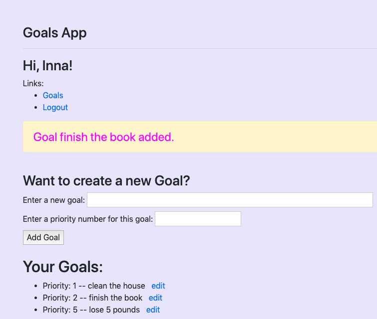

# Goals
---
Goals is a web app which allows a user (after they have registered and logged in)
to add their goals to the Postgres database via an HTML form.
Goals are displayed on the web page in order of their priority, 
and a user can edit their goals by deleting any entry and creating a new one in its place.
---
To run the app, clone the repository, create and activate virtual environment, 
and install requirements.
Create database "goals" and connect to the database by running model.py,
run server.py, register and log in, and then prioritize and enter your goals.
Edit as needed.

 

